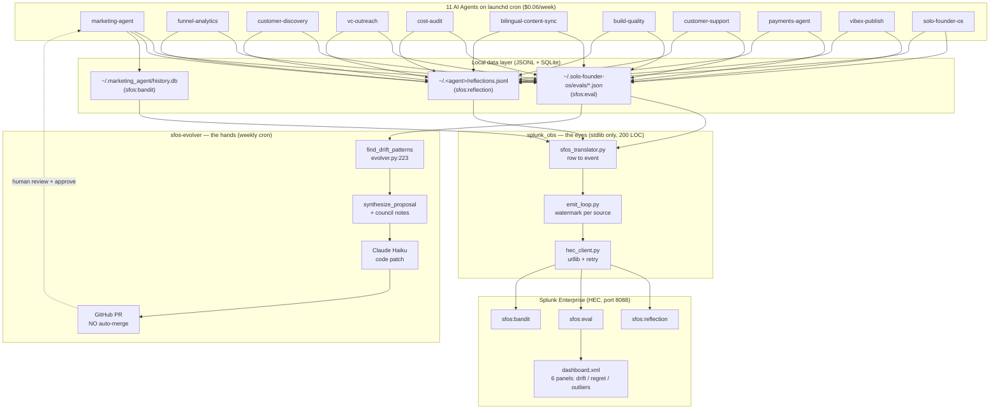

# Architecture Diagram

**Solo Founder OS · splunk_obs + sfos-evolver — closed-loop agent ops**

## High-level loop

## Closed-loop sequence

1. **11 agents** write JSONL traces to `~/.solo-founder-os/` and `~/.<agent>/` directories.
2. **sfos-eval** (L6 of the stack) scores each example 1 to 5 with a Claude judge (Brier-style).
3. **splunk_obs** tails 3 streams and emits to Splunk HEC every 5 minutes (per-source watermark, dedup-safe across restarts).
4. **6-panel dashboard** surfaces drift in Splunk:
   - Panel 1: Agent Run Trace (24h)
   - Panel 2: Eval Drift over time (per skill mean Brier, 30d)
   - Panel 2b: Low-tail (p10) Drift Alert table
   - Panel 3: Bandit Regret cumulative
   - Plus 2 more for reflections + HITL rejections
5. **sfos-evolver** reads the same drift signal weekly. When a skill regresses >0.5 mean across two runs OR a failure repeats >=3 times, it asks Claude Haiku to propose a patch.
6. **Hard whitelist**: prompts / schemas / error-strings / markdown only. **Never** touches auth / network / money code (see `is_safe_path` in `evolver.py:87`).
7. **GitHub PR is the gate**. Human reviews and approves. No auto-merge.

## Key files

| Path | Role | LOC |
|---|---|---|
| `solo_founder_os/splunk_obs/hec_client.py` | stdlib HEC client + HMAC webhook verify | 122 |
| `solo_founder_os/splunk_obs/sfos_translator.py` | row to event per sourcetype | 80 |
| `solo_founder_os/splunk_obs/emit_loop.py` | tail + watermark per source | 110 |
| `solo_founder_os/splunk_obs/dashboard.xml` | 6-panel Splunk dashboard | XML |
| `solo_founder_os/evolver.py` | find_drift_patterns + synthesize_proposal + GitHub PR | 672 |
| `solo_founder_os/eval.py` | Brier judge over record_example data | 240 |
| `solo_founder_os/council.py` | 5-voice council + ICPL preference logging | 180 |

## Why this shape

- **Stdlib only**: no `requests`, no Splunk SDK, no new pip deps. Enterprise pip install politics avoided.
- **HEC + Classic Dashboard XML**: works on every Splunk version since 2014.
- **Disk-based bus**: agents communicate through JSONL files, not a message queue. Restart is free.
- **PR-gated evolver**: Reflexion + DGM papers showed self-improvement works, but only when constrained. The whitelist was locked before the first Haiku prompt was written.

License: MIT
